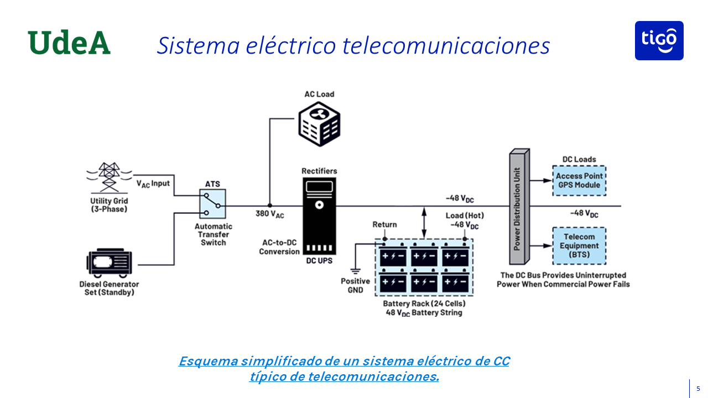
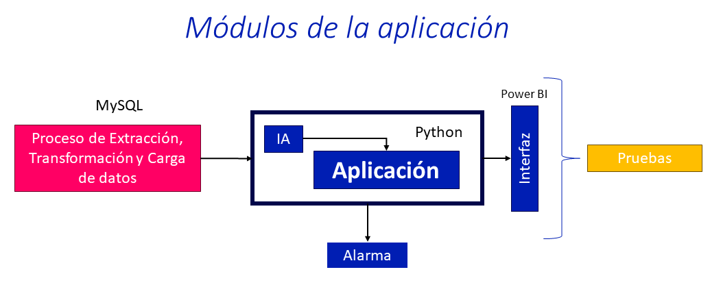

<h1 align="center">
Desarrollo de una aplicación de evaluación técnica para la instalación de equipos en infraestructura de telecomunicaciones
</h1>

<h3 align="center">Mateo Hoyos Mesa</h3>

  
  

#### Objetivo

Desarrollar una aplicación para verificar la capacidad de instalación de nuevos equipos en un
nodo de telecomunicaciones, mediante la automatización de los procedimientos técnicos,
integrando datos de infraestructura eléctrica y térmica para reducir el tiempo en la evaluación
técnica, mejorar el proceso en la expansión de la infraestructura del nodo y generar alarmas
automáticas ante condiciones críticas de operación.

#### Sistema electrico

#### Módulos

#### flujo general

   
