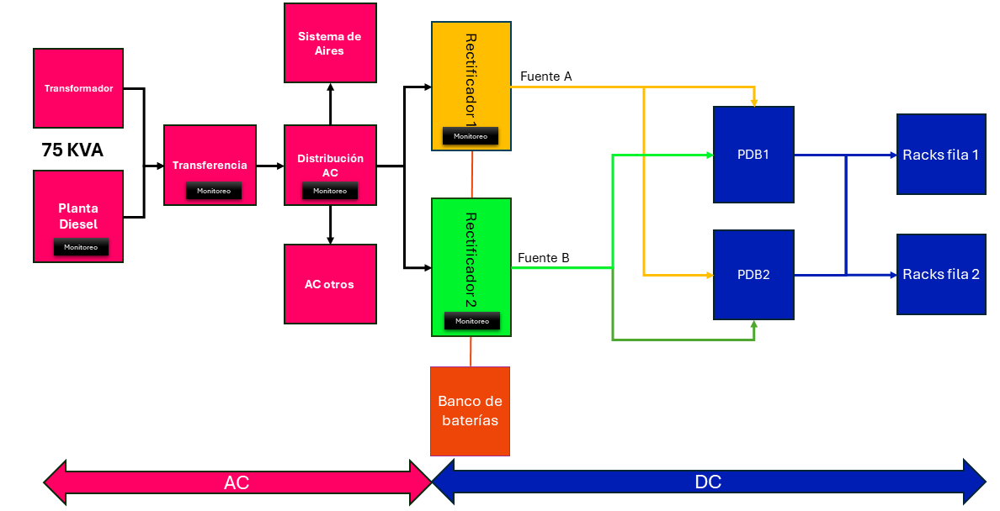
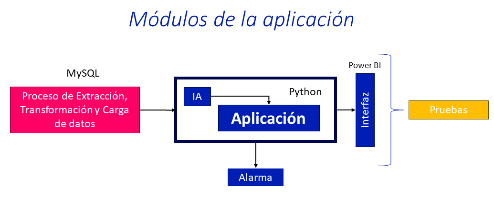
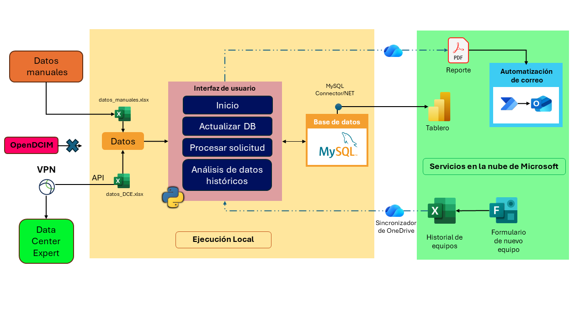
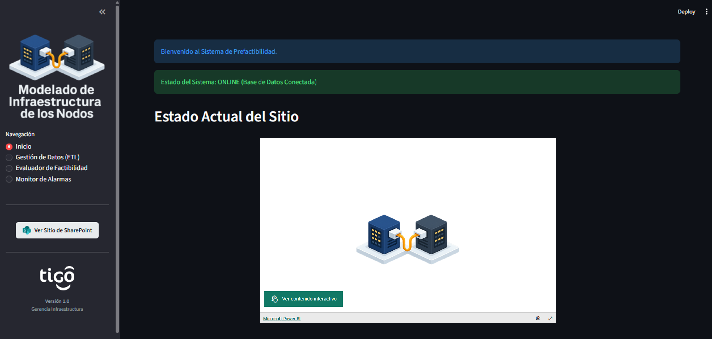

  <h1 align="center">
Desarrollo de una aplicación de evaluación técnica para instalación de equipos en infraestructura de telecomunicaciones
</h1>

<h3 align="center">Mateo Hoyos Mesa</h3>

  
  &nbsp;&nbsp;&nbsp;&nbsp;
  

## Tabla de contenido

- [Objetivo general](#objetivo-general)
- [¿Por qué se desarrolló este sistema?](#por-qué-se-desarrolló-este-sistema)
- [Sistema eléctrico](#sistema-electrico)
- [Funcionalidades](#funcionalidades)
- [Módulos](#módulos)
- [Arquitectura](#arquitectura)
- [Modelo de Inteligencia Artificial](#Modelo-de-Inteligencia-Artificial)
- [Resultados](#Resultados)
- [Mejoras futuras](#Mejoras-futuras)
- [Tecnologías utilizadas](#tecnologías-utilizadas)
- [Entorno de desarrollo](#entorno-de-desarrollo)

## Objetivo general

Desarrolló de una aplicación que permita verificar si un nodo de telecomunicaciones tiene capacidad técnica para instalar un nuevo equipo, automatizando el proceso de evaluación eléctrica y física que actualmente se realiza de forma manual, integrando datos de infraestructura en tiempo real y generando un resultado estructurado de aprobación o rechazo

### ¿Por qué se desarrolló este sistema?

Tigo opera una red de nodos de telecomunicaciones distribuidos en Colombia. Cada vez que ingeniería solicita instalar un nuevo equipo en un nodo, el equipo de infraestructura debe evaluar manualmente si el sitio tiene capacidad para recibirlo. Este proceso implica revisar el espacio físico disponible en los racks, verificar que el sistema eléctrico soporte la nueva carga, recorrer el circuito completo desde el punto de conexión hasta el transformador, y confirmar que ninguna protección quede sobrecargada. Todo esto se hace revisando planos, tomando mediciones en campo y haciendo cálculos a mano, lo que lo convierte en un proceso lento, propenso a errores y difícil de escalar cuando hay múltiples solicitudes activas.

## Sistema electrico

  <em>
    Fuente:
    <a href="https://convertronic.net/potencia/fuentes-de-alimentacion/creacion-de-una-mejor-fuente-de-alimentacion-de-48-vcc-para-equipos-de-telecomunicaciones-5g-y-de-proxima-generacion.html" target="_blank">[Sistema eléctrico del nodo de telecomunicaciones.]</a>
  </em>

## Funcionalidades

- Evaluación eléctrica del nodo
- Evaluación de capacidad física
- Detección de anomalías usando IA
- Generación automática de reportes en PDF
- Visualización interactiva

## Módulos

## Arquitectura

El sistema se compone de los siguientes módulos:
- ETL: procesamiento y limpieza de datos
- Evaluador: lógica de validación técnica
- Modelo de IA: detección de anomalías (Isolation Forest)
- Visualización: interfaz en Streamlit
- Reportes: generación de PDF

### flujo general

## Modelo de Inteligencia Artificial

Se utiliza el algoritmo Isolation Forest para detectar anomalías
en variables eléctricas y térmicas del nodo.

Este modelo permite identificar comportamientos fuera de lo normal
sin necesidad de datos etiquetados.

## Resultados

El sistema genera:

- Evaluación de viabilidad del nodo
- Identificación de anomalías
- Reporte técnico en PDF

  <em>
    <a target="_blank">[Tablero BI - Inicio]</a>
  </em>

  <em>
    <a target="_blank">[Interfaz con Streamlit - Inicio]</a>
  </em>

## Mejoras futuras

- Integración con IA generativa
- Despliegue en la nube
- Sistema de usuarios y permisos

## Tecnologías utilizadas
- Python
- Streamlit (interfaz)
- Pandas (procesamiento de datos)
- Scikit-learn - isolation-forest (modelo de IA)
- MySQL (base de datos)
- Reportlab (generar PDF)

## Entorno de desarrollo
- Sistema operativo: Windows 11
- IDE: Visual Studio Code
- Python 3.13.9

   
